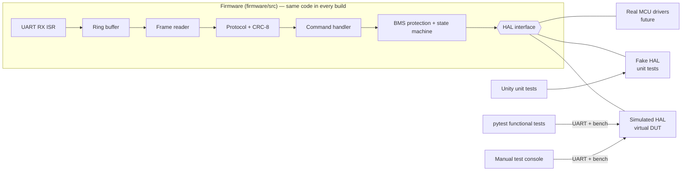

# Embedded BMS Firmware — QA & Test Automation Project


Firmware for a 4-cell lithium-ion **Battery Management System** written in C, and a complete
quality-assurance package around it: requirements, test plan, automated unit and functional
tests, manual test cases, Jira defect reports, coverage, static analysis, CI, and a test dashboard.

| | |
|---|---|
| **Automated tests** | 87 unit tests (Unity, C) · 56 functional tests (pytest) |
| **Coverage** | 99 % lines · 96.6 % branches of `firmware/src` |
| **Traceability** | 23 / 23 requirements verified |
| **Static analysis** | GCC `-Wall -Wextra -Wpedantic -Wconversion -Wshadow -Werror`, cppcheck — 0 findings |
| **Manual testing** | 18 scripted test cases + 2 exploratory charters |
| **Defects** | Tracked in Jira (project `BMS`) — reports + CSV import in `docs/bug-reports/` |

## What the firmware does
- Monitors 4 cell voltages, pack temperature and current every 100 ms
- Protects the pack: over-/under-voltage, over-temperature, over-current, sensor plausibility,
  with **debounce** (3 cycles) and **hysteresis**, by switching off the charge/discharge MOSFETs
- State machine `INIT → IDLE / CHARGING / DISCHARGING → FAULT` with latched faults
- UART command protocol with **CRC-8** framing, ISR-safe **ring buffer**, over-length recovery

## Architecture



The **Hardware Abstraction Layer** is the key design decision: the protection logic never touches
hardware directly, so it can be unit-tested with a fake, driven by a simulator the way a
hardware-in-the-loop (HIL) rig drives a board, and later ported to a real MCU unchanged.

## Test strategy (see [docs/test_plan.md](docs/test_plan.md))

| Level | Tooling | Examples |
|-------|---------|----------|
| Static | GCC warnings-as-errors, cppcheck | Implicit conversions, shadowing |
| Unit | **Unity** + fake HAL + gcov | 4199 / 4200 mV boundary, debounce reset, ring-buffer wrap-around |
| Integration | Unity | ISR → parser → command → UART TX |
| Functional | **pytest** + simulator | Fault timing (200 ms vs 300 ms), hysteresis, bad CRC not executed, 500-command stress |
| Manual | Test console, CSV test cases, **Jira** | Scripted cases, exploratory charters |
| Regression | **GitHub Actions** | Full pipeline on every push, dashboard published to GitHub Pages |

Techniques: boundary value analysis, equivalence partitioning, state transition, decision table,
timing, error guessing, stress, and **defect seeding** (see [BMS-1](docs/bug-reports/BMS-1.md)).

## Quick start

Requirements: GCC, CMake ≥ 3.20, Ninja, Python ≥ 3.12, cppcheck.
(Windows: `winget install BrechtSanders.WinLibs.POSIX.UCRT` provides all of them except Python.)

```bash
python -m venv .venv
.venv/Scripts/activate            # Linux/macOS: source .venv/bin/activate
pip install -r requirements-dev.txt
python tools/run_all.py           # build + all tests + coverage + static analysis + dashboard
```

Open `reports/dashboard.html` for the results.

### Manual testing
```bash
cmake -S . -B build -G Ninja && cmake --build build
python tools/bms_console.py
```
```
bms> @TICK 1            # bench: run one 100 ms cycle
bms> @CELL 0 4200       # bench: inject a cell voltage
bms> @TICK 3
bms> status             # state, faults, FET outputs
bms> CLEAR_FAULTS       # UART command, CRC added automatically
bms> !raw $PING*00      # raw line for negative tests
bms> log evidence.log   # save the transcript for a Jira bug
```
Execute the cases in [docs/manual_test_cases.csv](docs/manual_test_cases.csv), fill in
*Actual_Result / Status / Tester / Date*, log failures in Jira, and re-run `tools/run_all.py` —
the dashboard picks up the execution status.

### Jira
`docs/bug-reports/jira_import.csv` imports both defects into a Jira Cloud project
(*Settings → System → External system import → CSV*). Map *Severity* to a custom field or skip it.

## Repository layout
```
firmware/inc, firmware/src   production C code (HAL-based, no hardware dependencies)
firmware/sim                 simulated HAL + virtual DUT executable (bms_sim)
tests/unit                   Unity tests + fake HAL
tests/functional             pytest tests + DUT driver (bms_dut.py)
tools/                       run_all.py, make_dashboard.py, bms_console.py
docs/                        requirements, test plan, manual test cases, Jira bug reports
vendor/unity                 Unity test framework (MIT)
.github/workflows/ci.yml     CI pipeline + GitHub Pages dashboard
```
